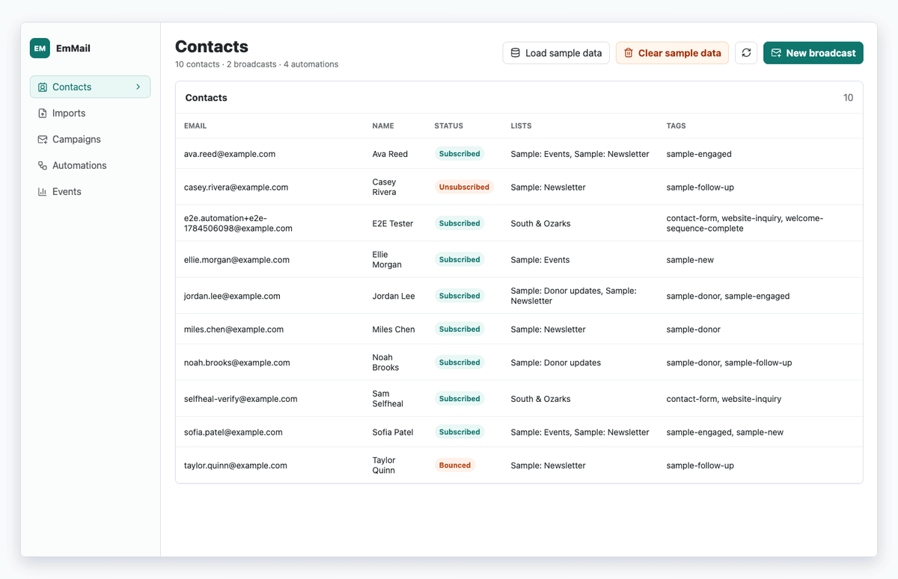
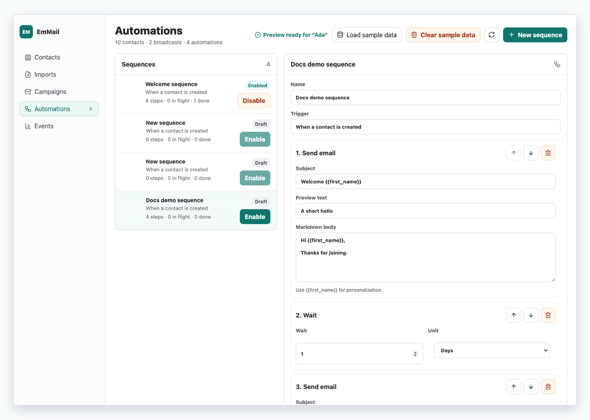
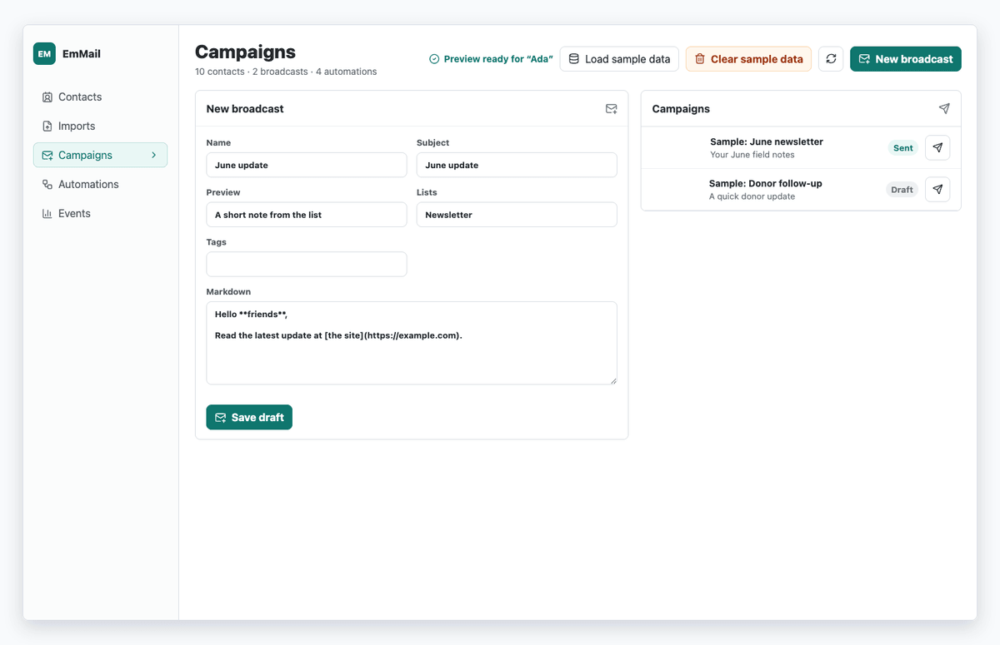

# EmMail · v0.1

> **Your email list, on your own metal** — contacts, broadcasts, and welcome sequences without a $99/month marketing cloud. Runs on Cloudflare. Sends through [Resend](https://resend.com). You keep the list.

EmMail is a small email marketing app for a **single site**. It is not Mailchimp, and it does not try to be. It is the bit of ActiveCampaign most sites actually use: a list, a broadcast, a welcome sequence, unsubscribe, and tracking you own.



## ✨ What you get today

🎯 **A real contact list** — import CSV, tag people, keep suppressions, honor unsubscribes.

📨 **Broadcasts** — write in Markdown, queue a send, watch pending → sent → delivered. Opens and clicks hit *your* domain, not a vendor pixel farm.

🔁 **Welcome / follow-up sequences** — linear automations: send an email, wait, add a tag. Disable to edit. Preview a draft without mailing anyone.





What it is **not** (yet): a Canva-style email designer, a branching automation canvas, landing pages, or a multi-user marketing department. Those are on the list below.

## 💸 What it costs

The honest split: **Cloudflare is cheap. Resend is the meter that moves with volume.**

| Piece | Idle / small list | Notes |
|---|---|---|
| **Cloudflare Workers Free** | **$0** | Possible on paper. This app’s send consumer (HTML + signing + D1) often wants more than Free’s **10 ms CPU** per run. |
| **Workers Paid** | **$5 / month** | The realistic floor. Account-wide, not per app. Covers the Worker, D1, Queues, the every-minute sweeper, and a custom domain. |
| **Resend** | their email pricing | Separate from Cloudflare. You pay for mail that actually leaves. Keep `EMMAIL_SEND_MODE=dry-run` until a domain is verified. |

On **Workers Paid**, a quiet list sits inside the included allotments. Rough fit:

| | Free (if it even runs) | ~$5/mo Paid included |
|---|---|---|
| **Contacts stored** | Fine into the hundreds of thousands | Same 5 GB D1; millions of rows before storage is the problem |
| **Broadcasts** | Hundreds–low thousands/day, then CPU or D1 writes bite | Comfortably **millions of emails / month** before D1 write overages |
| **Automation emails** | ~thousands/day (Queues 10k ops/day, ~3 ops per message) | Large welcome funnels fit the included million queue ops |
| **Automation definitions** | Dozens–hundreds | Same — the limit is *running* enrollments + mail, not how many sequences you save |

Cloudflare quotas are **account-wide**. If this Worker shares a D1 or an account with other apps, they eat the same pie. Open/click tracking adds extra Worker hits and D1 writes on top of sends.

> **$5 + Resend vs $49–149/mo for a hosted ESP.** The catch is you operate it. No success manager, no drag-and-drop campaign builder, no “we’ll pause your account if the list looks bought.”

## EmMail vs the usual suspects

| | **EmMail** | **ActiveCampaign** (SaaS) | **Mautic** (self-host) | **FluentCRM** (WordPress) |
|---|---|---|---|---|
| **Monthly floor** | ~$5 Cloudflare + Resend | Typically tens–hundreds, contact-tiered | A VPS (~$5–40) + your time | WP host you already pay + plugin |
| **Who owns the list** | You, in D1 | Them, with an export | You, in MySQL | You, in `wp_users` / CRM tables |
| **Setup** | Cloudflare account, a domain, Resend, this repo | Sign up and import | PHP, MySQL, cron, updates, plugins | Install a plugin, stay on WordPress |
| **Builder** | Markdown + a linear step list | Mature visual campaigns + email designer | Mature, heavier UI | Good enough for WP shops |
| **Fits** | One site, “I want the list not the suite” | Teams that want support, scoring, CRM, SMS | People who like running PHP apps | Woo / WP sites that should not leave WordPress |
| **Pain** | You ship features. No branching flows yet. | Price + lock-in + contact caps | Patch Tuesday forever | Tied to WordPress. Fine until it isn’t. |

**Not a SaaS replacement.** ActiveCampaign wins if you need deal pipelines, SMS, and a vendor to call. **Not a Mautic replacement.** Mautic wins if you want a full open-source marketing suite and will babysit PHP. **Not a FluentCRM replacement.** FluentCRM wins if the site *is* WordPress and the list already lives there.

EmMail wins when the site is already on Cloudflare (a Worker, Pages, or a static front), you want **one** list and **one** welcome flow, and you would rather pay compute than a contact tax.

## 🚧 Limitations (today)

- **One tenant.** Fork, rename, ship. There is no multi-site admin. Config in this repo is still a branded example — see the install WIP note below.
- **Linear automations only** — `send_email`, `wait`, `add_tag`. No branches, no “opened / didn’t open,” no goal split.
- **Markdown emails**, rendered through a React Email shell. No block canvas, no image gallery, no “drop a button here.”
- **Shared-secret admin**, not team roles. Cloudflare Access in front is the grown-up move; until then, `EMMAIL_ADMIN_TOKEN` is the gate (unset = nobody gets in).
- **No forms / landing pages / preference center.** Ingest is a sidecar endpoint for the public site.
- **No A/B, no send-time optimization, no RSS-to-email.** Campaign stats are a rollup, not a BI tool.
- **Free-plan CPU is tight.** Budget **Workers Paid** if you actually send.
- **Resend idempotency is 24h.** Welcome-mail at-most-once is solid; a pathological D1 outage plus a re-submit after that window can theoretically double a welcome. See the sending notes below.

## 🗺 What’s next

Not a contract. A punch list, in the order it would actually get used.

**Soon-shaped**

- **Visual email builder** — rows, columns, a button, an image, dark-mode preview. Markdown stays as the escape hatch for people who write faster than they drag.
- **Drag-and-drop automation canvas** — same engine, less “edit a JSON-ish step list.” Branches: *opened / clicked / tagged / waited*. A kill-switch still sits on the sequence, not buried in a node.
- **Saved segments** — “subscribed + tag X, not complained” as a named audience, not a one-off campaign filter.
- **Inbox preview** — render Gmail / Apple Mail / a skinny phone pane before you hit send. “Looks fine in the admin” is a famous last sentence.

**Fun, still real**

- **Subject gym** — three subject lines, pick one, or split 10% of the list. No 27-variant science fair.
- **Quiet hours** — don’t wake a sequence at 3am in the contact’s timezone. The minute cron already exists; it should learn manners.
- **List hygiene desk** — bounce / complaint hospital, “this address has never opened,” one-click suppress. Deliverability is a feature.
- **Preference center** — topics, not just unsubscribe-forever. “Still want launch notes, skip the diary.”
- **RSS → draft broadcast** — new site post becomes a campaign draft, human still hits send.
- **AI copy pass** — rewrite preview text, tighten the CTA, don’t auto-send. Humans stay on the trigger.
- **Site-form ingest widgets** — WordPress, or any static/Worker front, without a handmade sidecar secret every time.

**Later / maybe never**

- Full CRM, SMS, landing-page CMS, multi-tenancy as a product. If you need those, buy ActiveCampaign or run Mautic. EmMail should stay a **mail core**, not a second WordPress.

## ☁️ Get it on Cloudflare

You need: a [Cloudflare](https://dash.cloudflare.com) account, a domain already on Cloudflare, and a [Resend](https://resend.com) account with a verified sending domain.

**Recommended:** turn on **Workers Paid** ($5/mo) before the first live send.

Letting an AI coding tool do the Wrangler work? Cloudflare’s public [skills](https://github.com/cloudflare/skills) (`wrangler`, plus the platform `cloudflare` skill) and [MCP servers](https://developers.cloudflare.com/agents/model-context-protocol/mcp-servers-for-cloudflare/) (docs, bindings, API) are the right helpers — Workers, D1, Queues, secrets, custom domains. This is a **Worker with static assets**, not Pages. Do not `wrangler pages deploy` this repo.

### WIP: rebrand before you ship

Checked-in config still uses example tenant names (Worker name, D1 database, queue, custom domain, from-address, ingest path, welcome copy). **Rename those to yours** before a real deploy. A cleanup pass on `wrangler.toml`, `package.json` migrate scripts, `.dev.vars.example`, and the ingest route is coming; until then, treat them as templates.

| File | What to change |
|---|---|
| `wrangler.toml` | `name`, `APP_BASE_URL`, `DEFAULT_FROM_*`, `[[routes]]` hostname, D1 `database_name` / `database_id`, queue name |
| `package.json` | `db:migrate:local` / `db:migrate:remote` still pass the example D1 name — match whatever you put in Wrangler |
| `.dev.vars.example` | From-address and dummy secrets |
| `src/email/welcome.ts` | Subject/body still example-branded |
| Ingest route | Still `/api/integrations/<example>/contact-message` until the backend pass |

### 1️⃣ Worker + hostname

EmMail is a **Worker with static assets**, a custom domain, D1, and a Queue.

```text
Worker name     → whatever you set in wrangler.toml  (example: emmail)
Custom domain   → mail.yourdomain.com  (or a workers.dev URL while testing)
```

`workers.dev` stays as a fallback even after you attach a custom domain.

### 2️⃣ Create the database and the send queue

```bash
npx wrangler d1 create emmail
npx wrangler queues create emmail-send
```

Put the D1 `database_id` and names into `wrangler.toml` (and the migrate scripts), then:

```bash
npm run db:migrate:remote
```

D1 Free accounts cap out at **10 databases**. If create fails, you are at the cap — don’t keep retrying.

### 3️⃣ Secrets (never commit these)

```bash
npx wrangler secret put RESEND_API_KEY
npx wrangler secret put RESEND_WEBHOOK_SECRET
npx wrangler secret put TRACKING_SECRET
npx wrangler secret put EMMAIL_INGEST_SECRET
npx wrangler secret put EMMAIL_ADMIN_TOKEN
```

In `wrangler.toml`, set `APP_BASE_URL`, `DEFAULT_FROM_EMAIL`, `DEFAULT_FROM_NAME`, and keep **`EMMAIL_SEND_MODE=dry-run`** until Resend is verified and a test loop has been watched.

### 4️⃣ Ship it

```bash
npm run deploy   # build admin assets, typecheck, wrangler deploy
```

Point Resend’s webhook at `https://<your-host>/webhooks/resend`. Log in at `/login` with the admin token.

**Do not arm both** `EMMAIL_WELCOME_ENABLED=true` **and** an enabled `contact_created` automation on the same list — new leads get two welcomes. Prefer the multi-step sequence; leave the one-shot flag off.

## 🏃 Run it on your machine

```bash
npm install
cp .dev.vars.example .dev.vars   # rotate the dummy admin token
npm run dev:setup                # local D1 migrations
npm run dev:local                # Worker :8787 + Vite :5173
```

Open [http://127.0.0.1:5173/login](http://127.0.0.1:5173/login), paste `EMMAIL_ADMIN_TOKEN` from `.dev.vars`, then use the admin with live UI reload. Vite proxies `/api` and `/login` to the Worker so cookies match.

Worker-only preview (rebuild the admin after UI changes):

```bash
npm run build:admin
npm run worker:dev               # http://127.0.0.1:8787/login
```

Sample contacts from the admin **Seed** control, or (Worker must be up, send the admin token):

```bash
npm run sample:seed
npm run sample:clear             # only the canned demo rows
```

Seed the welcome sequence from Automations → **Seed welcome**, enable it, then hit the ingest endpoint or your site’s contact form.

---

## For developers

### Stack

- **Cloudflare Workers** — API, tracking pixels, unsubscribe, admin gate
- **D1** — contacts, campaigns, automations, events, suppressions, imports
- **Queues** — broadcast drain + automation wakes (`max_concurrency = 1` on purpose)
- **Cron** `* * * * *` — due waits (>12h queue delay cap) and stuck enrollments
- **React / Vite** admin, served as Worker static assets
- **Resend** — batch send + bounce/complaint webhooks
- **React Email** — campaign + automation HTML

### Sending

`POST /api/campaigns/:id/send` snapshots the audience into `campaign_recipients` and enqueues one message. The consumer drains pending rows in Resend batches of **100**, then re-enqueues until none remain. The Resend idempotency key is `batch-campaign/{id}/{batchIndex}`. `campaigns.last_completed_batch` only advances in the same D1 batch as the outcomes, so a redelivered queue message resends the **same** payload instead of skipping or doubling people.

Re-POST `/send` is the recovery path: it enqueues a drain if anything is still `pending`, and is a no-op once the campaign has drained.

`GET /api/campaigns/:id/stats` is the rollup (`total/sent/delivered/opened/clicked/pending/failed`).

### Welcome (one-shot flag)

When `EMMAIL_WELCOME_ENABLED=true`, ingest enqueues `{ type: "welcome", contactId }` unless a `welcome_sent` event already exists. At-most-once per contact; the consumer re-checks the flag (kill switch) and `suppressions`. Copy lives in [`src/email/welcome.ts`](src/email/welcome.ts). Prefer a `contact_created` sequence over this flag.

### Automations

| Piece | Role |
|---|---|
| `automations` / `automation_steps` / `automation_enrollments` | Schema (migration `0004`) |
| Trigger `contact_created` | Enroll on site contact-form ingest |
| Steps | `send_email`, `wait` (seconds), `add_tag` |
| Queue `{ type: "automation", enrollmentId }` | Drain until a wait or completion |
| Cron `* * * * *` | Re-queue due waits and stuck actives |

Bodies support `{{first_name}}`. Disable a sequence before editing name or steps. **Preview sequence** renders an unsaved draft; it does not send mail.

```bash
npm test -- tests/worker/ingest-automation.test.ts
```

Helpers: [`tests/helpers/mail-harness.ts`](tests/helpers/mail-harness.ts).

### Admin / API (auth required unless noted)

- `GET/POST /api/sample-data/{status,seed,clear}`
- `POST /api/integrations/<example>/contact-message` (ingest secret; path is still example-branded — WIP)
- `POST /api/campaigns/:id/send` · `GET /api/campaigns/:id/stats`
- `GET/POST /api/automations` · `POST /api/automations/preview` · `PATCH /api/automations/:id`
- `PUT /api/automations/:id/steps` · `POST .../seed-welcome` · `.../enable` · `.../disable`
- `GET /api/automations/:id/enrollments`

Public: `/t/open/...gif`, `/t/click/...`, `/unsubscribe/...`, `POST /webhooks/resend`.
